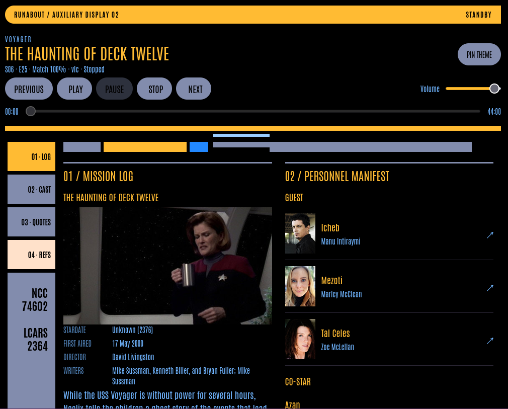

# Runabout

A local Star Trek second screen built with Rails, Hotwire, SQLite, and the LCARS-26 themes. It follows VLC, mpv, or another MPRIS player on the same Linux desktop and shows the episode's cast, references, quotes, and mission log.



## Start

Requires Ruby 4.0.1 (rbenv works), Bundler, a desktop D-Bus session, and `7z` for the Memory Alpha download. Chromium and chromedriver are needed only for browser tests.

```sh
bundle install
bin/setup --skip-server
bin/rake runabout:ingest
bin/rake runabout:scan
bin/dev
```

Open **http://localhost:2364**, or `http://<this-machine's-LAN-IP>:2364` on a tablet. Run `bin/dev` from your desktop session so the watcher inherits `DBUS_SESSION_BUS_ADDRESS`. There is no player setup, HTTP password, Redis, or authentication. This is a household LAN application; the web process binds to all interfaces.

`bin/dev` supervises the three commands in `Procfile`, restarting a crashed process and forwarding shutdown to the children:

- `web`: Puma on port 2364.
- `watcher`: the sole D-Bus connection, signal subscriptions, ten-second reconciliation, and playback command execution.
- `jobs`: Solid Queue enrichment jobs. Solid Cable delivers watcher broadcasts across processes.

The application also works before importing: it shows the first-run instructions. With no player, unmatched media, or a disconnected bus, the last identified episode stays visible.

## Data and configuration

| Environment variable | Default / purpose |
| --- | --- |
| `RUNABOUT_DATA_DIR` | `./tmp/second-screen`; SQLite primary, queue, cable, and cache databases, downloaded dump, and watcher lock |
| `RUNABOUT_LIBRARY` | `/mnt/dhd/video/tv/Star Trek`; recursively scanned without changing media files |
| `RUNABOUT_PLAYER_PRIORITY` | `vlc,mpv`; ties between playing players are broken in this order |
| `TMDB_API_KEY` | Optional TMDB v3 key; used only for photographs |
| `XML` | An existing uncompressed MediaWiki XML dump, for `runabout:ingest` |

Pass the same `RUNABOUT_DATA_DIR` and `RAILS_ENV` to setup, rake tasks, and all processes. Tests use `storage/test.sqlite3` independently. Production uses separate database files in the same data directory; run `RAILS_ENV=production bin/rails db:prepare` and `RAILS_ENV=production bin/rails assets:precompile` before starting it.

An existing dump can be imported without network access:

```sh
XML=/path/to/memory-alpha.xml bin/rake runabout:ingest
```

The importer streams XML in three passes. It reads the dump's `Module:EpisodeData/A`, `N`, `S`, `D`, `M`, and `Y` data tables as plain data, **without executing Lua**. These supply canonical series, season/episode coordinates, and air dates; the episode sidebar alone does not contain them. Module metadata supplies a minimal episode record even when the article is absent. Double-length numbers such as `1x01/02` produce two records with shared article content.

Episode articles supply credits, quotes, summaries, and forward references. Entity articles supply offline lead extracts, categories, and reverse citations. Seen and mentioned references remain distinct; a reverse citation alone is treated as mentioned. Unknown categories remain visible under Other. Template-heavy prose is reduced to a plain-text extract; full fidelity comes from the cached rendered article.

An import builds a new version, then atomically switches the active catalog. An interrupted or failed import leaves the active version intact. The previous successful version remains until the following successful refresh; older and failed versions are then pruned. Library indexes, manual corrections, and viewing history store stable episode coordinates, so they survive catalog refreshes. A lock prevents simultaneous imports to the same database.

Series aliases, theme mappings, and ordered classification rules are data in `db/seeds.rb`. Edit the seeds and re-run ingest to improve them. TOS, TAS, ENT, and PRO use the classic fallback theme.

## Offline preparation and controls

```sh
TMDB_API_KEY=your_key bin/rake runabout:backfill
```

Both tasks print timestamped progress with elapsed time and flush each line immediately, including when redirected to a log file. Ingest reports download/extraction sizes, each XML pass with periodic page counts and the current page, catalog activation, and pruning. Backfill reports item totals and each network fetch, with separate counts for cache hits, newly fetched content, unavailable content, and photographs skipped because no TMDB key is set. Fast cached work and XML scans report at most once every five seconds; phase boundaries and network results always print.

Backfill caches rendered articles for the indexed episodes, their performers, and their references. It also stores actor and episode photographs in SQLite. Missing credentials or failed requests leave the layout image-free; no network request is made while rendering the base dashboard. When configured, photographs are also fetched by Solid Queue after an episode is identified.

Selecting a performer or entity fetches its rendered Memory Alpha article once, sanitizes it, rewrites internal links to local detail routes, and caches it permanently. An unavailable article shows its local extract and a retry link. Full articles, episode summaries, and production notes require an explicit spoiler reveal.

On narrow screens, LOG / CAST / QUOTES / REFS are native CSS `:target` tabs, starting on the mission log. The detail frame takes the full screen with a back control. On desktop, the panels form a 2×2 grid with a detail column alongside. Reference categories start collapsed and expand independently. Playback position advances locally between watcher updates. Seek and volume changes commit on release; every command is queued with the selected player and track identity and revalidated by the watcher. Rejected or expired commands display a temporary notice.

Use **Correct episode match** in the mission log to select one or two episodes for an unmatched or incorrectly identified file. The correction is permanent for that exact path and wins over both the library index and filename parsing. **Pin theme** freezes the current theme in browser storage until unpinned.

## Verification

```sh
bin/rails test
bin/rails test:system
bin/rubocop
bin/brakeman --quiet --no-pager --exit-on-warn --exit-on-error

# Optional real D-Bus protocol check against an isolated fake player:
RUNABOUT_TEST_BUS=1 RAILS_ENV=test dbus-run-session -- bin/rails runner script/check_mpris.rb
```

Unit/integration tests use a 20-page synthetic XML fixture and stub external HTTP clients. The filename fixture contains all 738 local library filenames; independent Memory Alpha coordinate data verifies **517 episode matches, nine doubles, and 221 unmatched extras**. Browser tests exercise theme persistence, commands, mobile tabs, and detail navigation. The isolated bus check covers discovery, property/seek signals, pause, seek units, volume, and player disappearance without controlling desktop players.

A full-dump import and actual library scan were also verified during implementation. Large dump files and personal databases are not checked into the repository.

## Attribution

Memory Alpha-derived content is attributed and linked in the interface, under **CC BY-NC**, for non-commercial use. [Memory Alpha](https://memory-alpha.fandom.com) is the source for the catalog and the coordinate regression fixture. The synthetic XML fixture contains original test prose, not copied episode articles.

This product uses the TMDB API but is not endorsed or certified by TMDB. [TMDB](https://www.themoviedb.org) supplies optional photographs only.

LCARS Inspired Website Template by [www.TheLCARS.com](https://www.thelcars.com). The six original standalone stylesheets and their fonts are copied unchanged to `public/lcars`; application layout adjustments live in `app/assets/stylesheets/application.css`.

See [the architecture](architecture/SECOND_SCREEN.md) for scope and future hooks. Act-, scene-, subtitle-level sync, films in the local library, remote-machine playback, and new pre-LCARS era themes remain out of scope.
